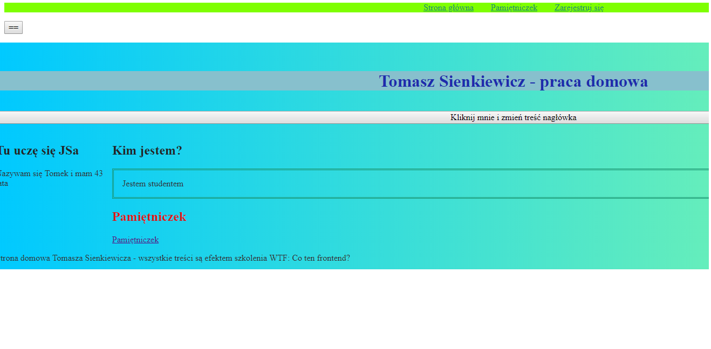

 

# Mój homepage

Zaparaszam na moją stronę: [Strona domowa Tomka WTF](https://sienkiewicztomasz.github.io/homepage-gulp/index.html)

##Aby uruchomić stronę lokalnie wykonaj poniższe polecenia

`npm install -g gulp-cli`

`npm install`

`gulp`

To publish your page using github pages use `npm run deploy`
